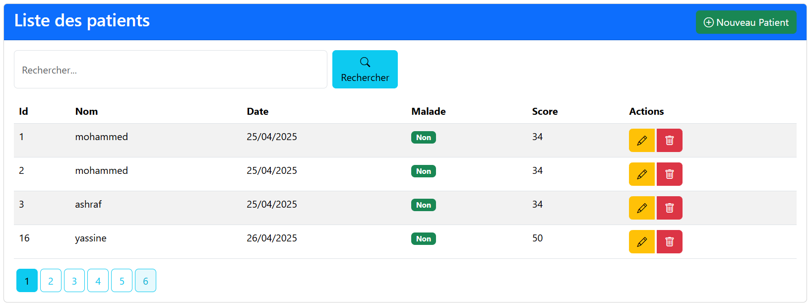

# Gestion des Patients - Application Hospitalière

<div align="center">
  
</div>

## 📋 Description

Cette application web de gestion des patients permet aux établissements hospitaliers de gérer efficacement les informations des patients. Développée avec Spring Boot, elle offre une interface intuitive pour consulter, rechercher, ajouter, modifier et supprimer des dossiers patients.

## 🛠️ Technologies Utilisées

<div align="center">
  
  
  
  
</div>

- **Spring Boot 3.4.4** - Framework Java pour le développement d'applications
- **Java 17** - Langage de programmation
- **Spring Data JPA** - Simplification de l'accès aux données
- **Thymeleaf** - Moteur de templates pour les vues
- **MySQL** - Base de données relationnelle
- **Bootstrap 5.3.3** - Framework CSS pour l'interface utilisateur
- **Bootstrap Icons 1.11.3** - Icônes pour l'interface utilisateur
- **Lombok** - Bibliothèque pour réduire le code boilerplate

## ✨ Fonctionnalités

- **Affichage des patients** - Liste paginée des patients
- **Recherche** - Filtrage des patients par nom
- **Ajout** - Création de nouveaux dossiers patients
- **Modification** - Mise à jour des informations des patients
- **Suppression** - Suppression de dossiers patients
- **Pagination** - Navigation facile entre les pages de résultats

## 🚀 Installation et Configuration

### Prérequis

- Java 17 ou supérieur
- Maven
- MySQL

### Étapes d'installation

1. **Cloner le dépôt**
   ```bash
   git clone https://github.com/golfyassine/tp3.git
   cd tp3

 
   


2. **Configurer la base de données**

   Modifiez le fichier `src/main/resources/application.properties` selon votre configuration MySQL :
   ```properties
   spring.datasource.url=jdbc:mysql://localhost:3306/hopital?createDatabaseIfNotExist=true
   spring.datasource.username=root
   spring.datasource.password=votre_mot_de_passe
<<<<<<< HEAD
   spring.jpa.hibernate.ddl-auto=update
   spring.jpa.properties.hibernate.dialect=org.hibernate.dialect.MariaDBDialect
   ```

   Note: L'application est configurée pour créer automatiquement la base de données si elle n'existe pas (`createDatabaseIfNotExist=true`).

3. **Compiler et exécuter l'application**
   ```bash
   mvn clean install
   mvn spring-boot:run
   ```

   Note: Au démarrage, l'application crée automatiquement 5 patients de test dans la base de données.

4. **Accéder à l'application**

   Ouvrez votre navigateur et accédez à `http://localhost:8084` (le port est configuré dans application.properties)
=======
   

3. **Compiler et exécuter l'application**
   ```bash
   mvn clean install
   mvn spring-boot:run
   ```

4. **Accéder à l'application**

   Ouvrez votre navigateur et accédez à `http://localhost:8084`

## 📊 Structure du Projet

- **Entités** - Modèles de données (Patient)
- **Repositories** - Accès aux données (PatientRepository)
- **Controllers** - Gestion des requêtes HTTP (PatientController)
- **Templates** - Vues Thymeleaf (patients.html)

## 📝 Modèle de Données

L'entité **Patient** contient les attributs suivants :
- `id` - Identifiant unique
- `nom` - Nom du patient
- `dateDeNaissance` - Date de naissance
- `malade` - État de santé (malade ou non)
- `score` - Score médical

## 🔍 Fonctionnalités de Recherche

L'application permet de rechercher des patients par nom avec pagination des résultats. La recherche est implémentée via Spring Data JPA avec des méthodes personnalisées dans le repository.

## 🔄 Pagination

La pagination est gérée côté serveur avec Spring Data et affichée dans l'interface utilisateur avec Bootstrap, permettant une navigation facile entre les pages de résultats.

## 🔒 Sécurité

Cette version de l'application ne contient pas encore de fonctionnalités d'authentification et d'autorisation. Ces fonctionnalités pourront être ajoutées dans une version future.

## 🔮 Évolutions Futures

- Ajout de fonctionnalités d'authentification
- Implémentation de rôles utilisateurs (médecin, infirmier, administrateur)
- Ajout et modification de patients
- Gestion des rendez-vous
- Statistiques et rapports
- Interface responsive pour mobile

## 📄 Licence

Ce projet est sous licence MIT. Voir le fichier LICENSE pour plus de détails.

## 👥 Contributeurs

- [BEKKOUCH Yassine] - Développeur principal


## 📊 Structure du Projet

- **Entités** - Modèles de données (Patient)
- **Repositories** - Accès aux données (PatientRepository)
- **Controllers** - Gestion des requêtes HTTP (PatientController)
- **Templates** - Vues Thymeleaf (patients.html)

## 📝 Modèle de Données

L'entité **Patient** contient les attributs suivants :
- `id` - Identifiant unique (Long, auto-incrémenté)
- `nom` - Nom du patient (String)
- `dateDeNaissance` - Date de naissance (Date)
- `malade` - État de santé (boolean, true = malade, false = non malade)
- `score` - Score médical (int)

## 🔍 Fonctionnalités de Recherche

L'application permet de rechercher des patients par nom avec pagination des résultats. La recherche est implémentée via Spring Data JPA avec deux méthodes dans le repository :

1. `findByNomContaining` - Méthode dérivée de Spring Data JPA qui recherche les patients dont le nom contient le mot-clé
2. `chercher` - Méthode personnalisée utilisant une requête JPQL pour la même fonctionnalité

L'application utilise actuellement la méthode `findByNomContaining` dans le contrôleur.

## 🔄 Pagination

La pagination est gérée côté serveur avec Spring Data JPA et affichée dans l'interface utilisateur avec Bootstrap. Caractéristiques de la pagination :

- Taille de page par défaut : 4 patients par page
- Navigation par numéros de page
- Maintien du mot-clé de recherche lors de la navigation entre les pages
- Affichage du nombre total de pages
- Mise en évidence de la page courante

## 🔒 Sécurité

Cette version de l'application ne contient pas encore de fonctionnalités d'authentification et d'autorisation. Ces fonctionnalités pourront être ajoutées dans une version future.

## 🔮 Évolutions Futures

- Ajout de fonctionnalités d'authentification
- Implémentation de rôles utilisateurs (médecin, infirmier, administrateur)
- Gestion des rendez-vous
- Statistiques et rapports
- Interface responsive pour mobile

## 📄 Licence

Ce projet est sous licence MIT. Voir le fichier LICENSE pour plus de détails.

## 👥 Contributeurs

- [Yassine] - Développeur principal

## 🛠️ Détails Techniques

- L'application utilise Lombok pour réduire le code boilerplate (annotations @Data, @NoArgsConstructor, @AllArgsConstructor, @Builder)
- La conversion des dates est gérée par un custom PropertyEditor dans le contrôleur
- Les messages de succès sont affichés après les opérations d'ajout, de modification et de suppression
- L'interface utilisateur est responsive grâce à Bootstrap 5.3.3
